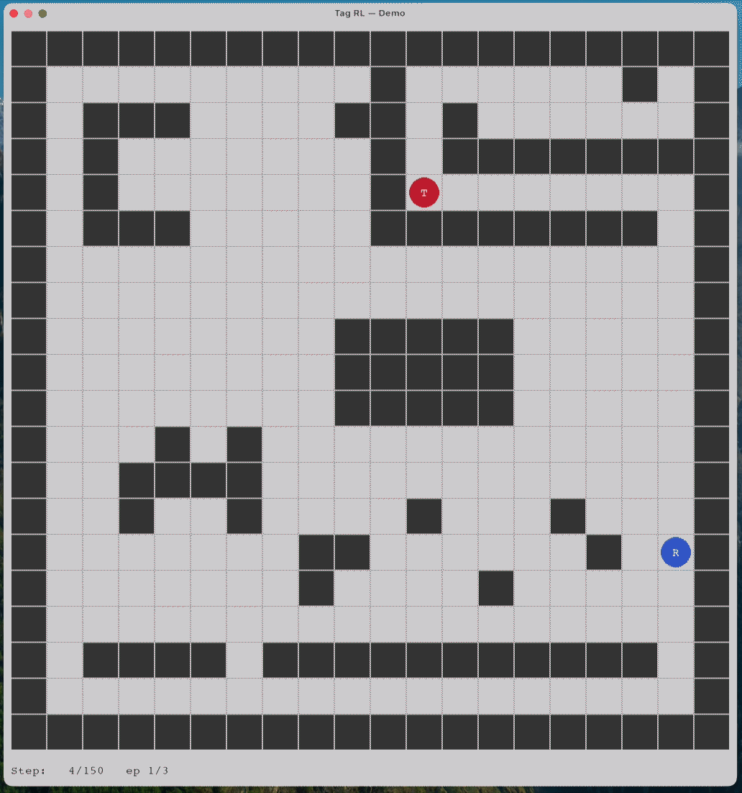
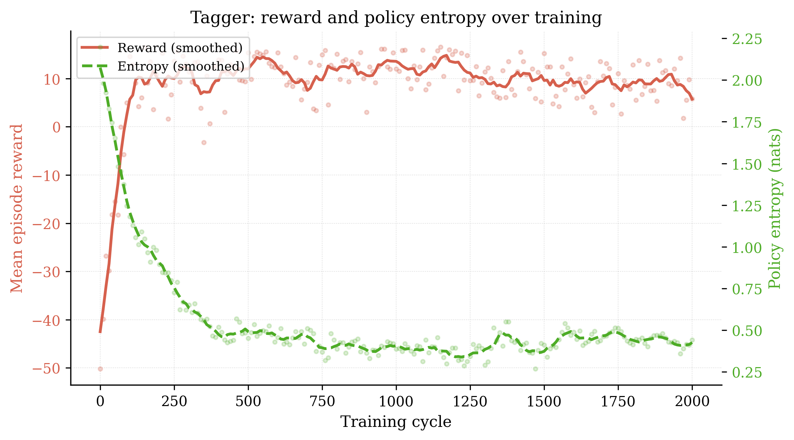
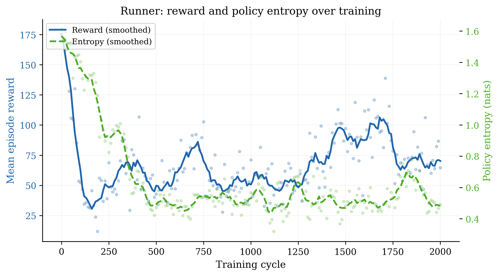
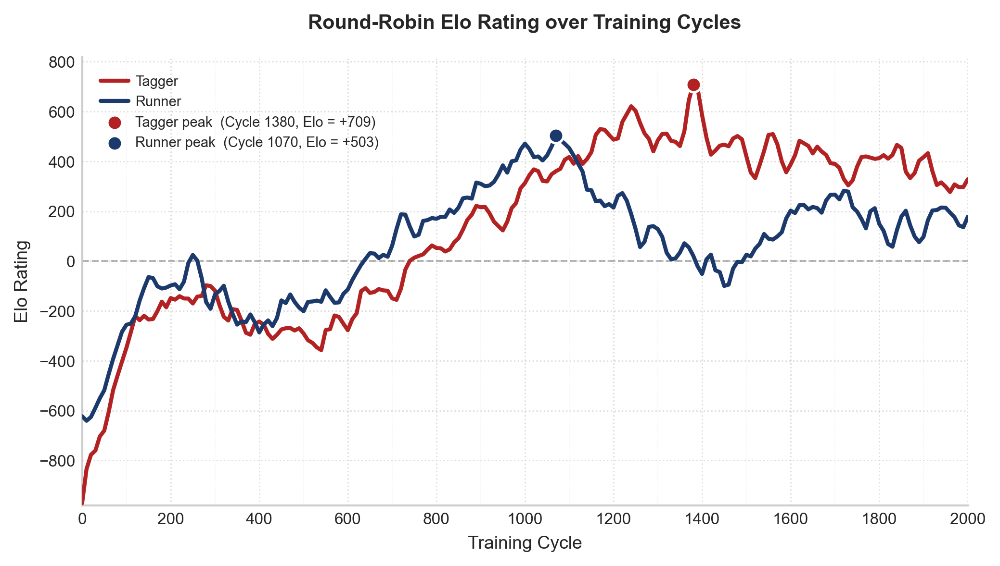
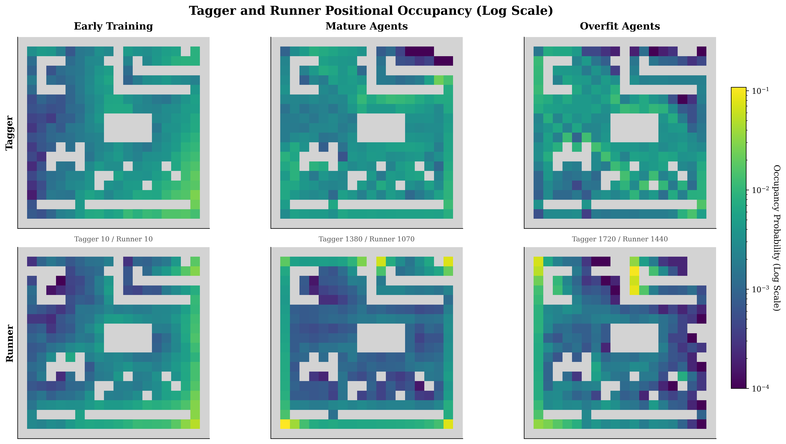
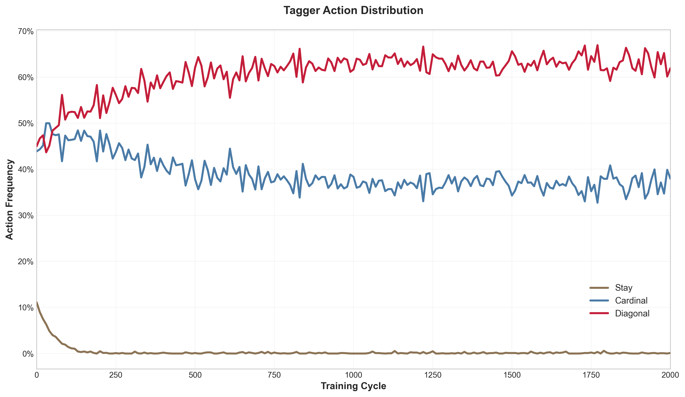
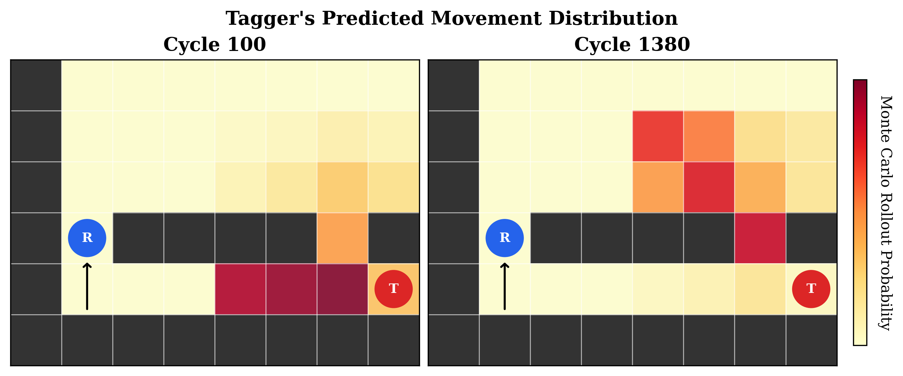

# Multi-Agent Reinforcement Learning (MARL) Tag

*Emergent Pursuit-Evasion Strategies via Adversarial Co-Training*

  

---

Can complex pursuit-evasion strategies emerge from scratch, through nothing but competition? This project trains two agents, a **tagger** (red) and a **runner** (blue), on a 20×20 grid using alternating PPO adversarial co-training with no hand-coded heuristics. Over 8 million environment steps, they develop wall exploitation, corner hiding, predictive interception, and sweep search entirely on their own.

**Authors:** Hashim Bukhtiar, Andrew De Rango, Ethan Otteson · April 2026 · [Read the paper](https://docs.google.com/document/d/1G1IJZz4IaCyTVb-Lp-zXH3I7HMstMcQRCZB8ZQZB5d8)

---

## Goals

1. Demonstrate emergent strategic behavior in a minimalist 2D environment
2. Distinguish genuine co-evolution from policy cycling and high-variance learning via round-robin Elo evaluation
3. Validate PPO stability under non-stationary adversarial co-evolution
4. Characterize learned behaviors through heatmaps, action profiles, and trajectory rollouts

---

## The Game

Two agents play tag on a discrete **20×20 grid** with fixed border walls and interior obstacles. The tagger moves first each step; if it occupies the runner's cell, the episode ends (tagger wins). If the runner survives **200 steps**, it wins. Neither agent has full information: line-of-sight is blocked by walls (Bresenham's algorithm), so agents must reason from last-known positions and a stale-memory flag.

### Observation Space

| Agent | Dim | Contents |
|---|---|---|
| Tagger | 15 | Own pos, last-known runner pos, velocity, 8 wall flags, visibility bit |
| Runner | 11 | Own pos, last-known tagger pos, velocity, 4 wall flags, visibility bit |

Positions are normalized to [0, 1]. When the opponent is occluded, the last-known coordinate is reported alongside a binary `opp_visible = 0` flag.

### Action Space

| Agent | Actions |
|---|---|
| Tagger | UP, DOWN, LEFT, RIGHT, UL, UR, DL, DR, STAY (**9 actions**; diagonal moves give a hunting advantage) |
| Runner | UP, DOWN, LEFT, RIGHT, STAY (**5 actions**) |

Wall-blocked moves leave the agent in place.

### Reward Structure

| Signal | Tagger | Runner |
|---|---|---|
| Per step | −0.1 (time penalty) | +1.0 (survival) |
| Terminal | +15 on catch | −15 on catch |
| Shaping | +λ·Δ(−distance) | +λ·Δ(distance) |
| STAY penalty | −0.5 | −0.1 |
| Revisit penalty | −0.2 for last 8 cells | — |

Potential-based shaping (Ng et al., 1999) guarantees the shaped and unshaped problems share the same optimal policy with no spurious incentives.

---

## Training

Agents are trained with **alternating PPO adversarial co-training**: one agent's weights are frozen while the other trains, then roles swap. This ensures each agent always faces a stationary opponent, keeping the MDP well-defined for the learning agent.

| Hyperparameter | Value |
|---|---|
| Algorithm | PPO (MlpPolicy, 2-layer MLP, 64 units) |
| Steps per cycle | 2048 per agent |
| Entropy coefficient | 0.025 |
| Discount factor γ | 0.99 |
| Learning rate | 3×10⁻⁴ |
| Total steps | ~8.2M (2000 cycles × 2 agents) |

Snapshots are saved every 10 cycles to `snapshots/`, yielding 201 checkpoints for post-hoc evaluation.

---

## Results

### Reward and Entropy

  

  

Training reward and policy entropy are tracked across all cycles for each agent. Both agents show a consistent rise in episode reward as co-training progresses. The tagger learns quickly to chase the runner, while the runner slowly learns strategies to evade and the tagger adapts. Policy entropy declines over time, reflecting increasing policy commitment, though it remains non-zero due to the entropy regularization term (`ent_coef=0.025`) that sustains exploration against a shifting opponent. The reward function is insufficient to confirm genuine co-evolution, as it only measures relative quality against the current opponent.

### Co-Evolution

Every historical tagger snapshot was evaluated against every historical runner snapshot (40,401 match-ups, 100 episodes each). A custom iterative Elo system assigns each snapshot a skill rating that isolates absolute capability from opponent-specific exploits.

  

Both agents improve monotonically through ~cycle 1000, confirming genuine transitive co-evolution. The tagger peaks at **Elo +709** (cycle 1380) and the runner at **Elo +503** (cycle 1070). Late-stage collapse, where both Elo curves dip sharply, reveals intransitive overfitting: agents micro-optimize against their current opponent and lose generalizability against the broader historical population.

### Emergent Spatial Behavior

  

Occupancy heatmaps track spatial strategy across three checkpoints. Early agents cluster randomly. At peak, the tagger sweeps the grid broadly to maximize line-of-sight, while the runner hugs walls and corners. The mature runner spent **83% of steps adjacent to a wall** vs. 46% early on. Late-stage overfit agents exhibit high variance and stray from generalized spatial reasoning, collapsing to narrow, brittle routes.

### Learned Action Profile

  

The tagger's STAY usage drops to ~0% by cycle 200. By cycle 1380, **over 65% of actions are diagonal**. The policy network learned the geometric advantage of diagonal traversal without being explicitly taught it.

### Predictive Interception

  

A 3-step Monte Carlo rollout of the tagger's action distribution at cycles 100 vs. 1380, with the runner occluded by a wall. The early tagger diffuses probability mass against the wall (reactive pursuit). The mature tagger routes sharply around the obstacle toward an intercept point *without ever seeing the runner*, demonstrating an implicit prediction of the runner's trajectory without explicit trajectory modeling.

---

## Get Started

- [Installation](docs/installation.md)
- [Training, evaluation, and plotting](docs/usage.md)
